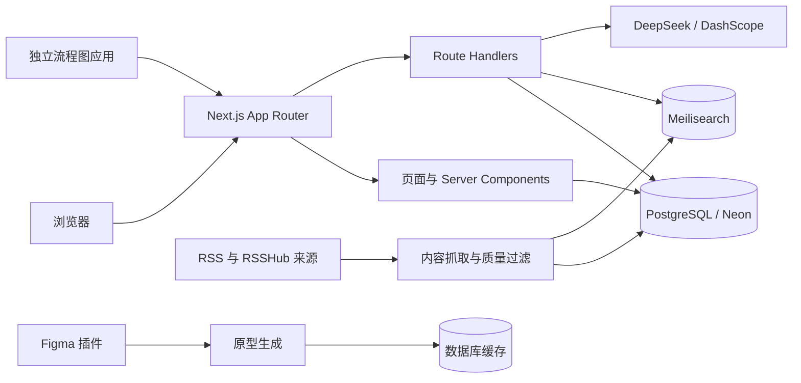

# PM Hub

PM Hub 是面向产品经理与产品从业者的综合学习平台，聚合专业资讯、职业发展内容、结构化题库和 AI 实用工具。

项目主体是一个 Next.js 全栈应用，并包含一个配套的 Figma 原型导入插件。当前生产数据层使用 PostgreSQL/Neon，搜索使用 Meilisearch，主要部署目标为 Cloudflare Workers（OpenNext）。

## 核心能力

### 1. 专业资讯

- 聚合产品管理、科技、人工智能和金融市场四类内容。
- 支持 RSS 增量抓取、来源健康状态、内容去重、正文补全和图片校验。
- 按不同分类执行独立的相关性评分、产品发布过滤、推广内容过滤和内容质量检查。
- 支持分类浏览、分页、首页轮播、每日精选和近期热点。
- 文章搜索优先使用 Meilisearch；不可用时回退到 PostgreSQL 模糊搜索。

主要入口：

- `/articles`
- `/articles/[slug]`
- `/categories/[category]`
- `/search`

### 2. 职业发展

- 聚合职场沟通、高效工作、团队协作和领导力内容。
- 支持 RSS、RSSHub、视频链接等内容来源。
- 通过质量分、分类匹配分、核心词组和负面主题规则控制内容准入。
- 支持标题去重、来源健康检查、缓存和每日兜底内容。

主要入口：

- `/career`
- `/api/career/feed`
- `/api/career/health`

### 3. 题库训练

- 产品思维训练：按行业、产品类型和难度筛选拆解题。
- 支持草稿保存、提交记录、DeepSeek AI 评分和无模型凭据时的规则兜底评分。
- 编程知识训练：覆盖前端、后端和数据库领域，支持会话、逐题作答、提交和结果复盘。
- 用户身份使用站点 Cookie 生成的匿名 `userKey`，不依赖账号系统。

主要入口：

- `/training`
- `/training/product-thinking`
- `/training/programming`

### 4. AI 实用工具

- PRD 生成：输入一段需求描述即可生成结构化 Markdown PRD，支持继续编辑、Markdown 下载和 Word 下载。
- 原型生成：根据页面描述、可选背景信息和参考图生成 `prototypeSpec`，支持版本修改、网页预览和 Figma 导入码。
- 流程图生成：通过 iframe 接入独立部署的 `next-ai-draw-io` 应用。
- PRD 和原型接口具有输入校验、提示词注入检测和基于 PostgreSQL 的跨实例 IP 限流。

主要入口：

- `/tools/prd`
- `/tools/prototype`
- `/tools/flowchart`

### 5. Figma 原型导入插件

`figma-plugin/pm-hub-prototype` 是配套插件，可通过短期导入码读取 PM Hub 生成的 `prototypeSpec`，并在 Figma 中创建可编辑图层。

安装和使用方式见 [Figma 插件说明](./figma-plugin/pm-hub-prototype/README.md)。

## 系统架构



### 数据流

1. `config/rss.ts` 和 `config/content-sources.ts` 定义内容来源。
2. `lib/rss/` 与 `lib/career/` 完成抓取、解析、过滤、评分、去重和入库。
3. PostgreSQL 保存文章、职业内容、抓取日志、缓存和训练数据。
4. `lib/search/` 将文章同步到 Meilisearch，并为搜索接口提供数据库回退。
5. App Router 页面从数据库组装首页、资讯、职业发展和训练内容。
6. AI 工具通过服务端接口调用模型，密钥不会发送到浏览器。

## 技术栈

| 层级 | 技术 |
| --- | --- |
| Web 框架 | Next.js 16、React 19、TypeScript 5 |
| UI | Tailwind CSS 4、Lucide React、Framer Motion、Embla Carousel |
| 数据库 | PostgreSQL / Neon、Drizzle ORM、postgres.js |
| 搜索 | Meilisearch |
| 内容解析 | rss-parser、fast-xml-parser、he |
| 数据校验 | Zod 4 |
| AI | DeepSeek Chat、DashScope/Qwen Vision 与图片模型 |
| 测试 | Vitest 4 |
| 部署 | OpenNext for Cloudflare、Wrangler |

## 数据模型

核心表定义在 `lib/db/schema.ts`：

- `articles`：专业文章。
- `rss_source_status`：RSS 来源状态。
- `fetch_logs`：RSS 抓取批次日志。
- `resources`：资源数据。
- `content_sources`：职业发展来源。
- `career_contents`：职业发展内容。
- `content_cache`：数据库缓存和原型临时数据。
- `content_fetch_logs`：职业内容抓取日志。
- `training_questions`：产品思维题目。
- `training_drafts`：产品思维草稿。
- `training_attempts`：产品思维答题记录。
- `training_evaluations`：AI 或规则评分结果。
- `programming_questions`：编程题目。
- `programming_sessions`：编程训练会话。

## 目录结构

```text
pm-website/
├─ app/                    # App Router 页面与 30 个 API Route Handler
├─ components/             # 布局、资讯、职业、训练、工具和通用 UI
├─ config/                 # RSS、职业来源、分类、封面和训练配置
├─ lib/
│  ├─ career/              # 职业内容抓取、质量、缓存和平台适配
│  ├─ db/                  # PostgreSQL 客户端、Schema 和迁移
│  ├─ home/                # 首页近期热点匹配规则
│  ├─ rss/                 # RSS 解析、质量、分类和相关性规则
│  ├─ search/              # Meilisearch 客户端与索引器
│  ├─ tools/               # PRD、原型、设计系统和临时存储
│  ├─ training/            # 产品思维评分和匿名用户标识
│  └─ utils/               # 鉴权、限流、图片代理和通用工具
├─ scripts/
│  ├─ prod/                # 可复用的生产/开发任务入口
│  ├─ maintenance/         # 一次性清理、重分类和审计脚本
│  └─ debug/               # 调试与阈值模拟脚本
├─ __tests__/              # Vitest 单元测试；integration 默认不执行
├─ data/                   # 题库和职业视频链接等种子数据
├─ public/                 # 分类默认封面和静态资源
├─ figma-plugin/           # PM Hub 原型导入插件
├─ _bmad/                  # BMAD 工作流配置，不参与应用运行
└─ _bmad-output/           # 项目约束、规格和调查产物
```

## 本地开发

### 环境要求

- Node.js `22.x`，项目明确限制为 `>=22 <23`。
- npm。
- PostgreSQL/Neon 数据库。
- Meilisearch 可选；未配置时搜索接口会尝试数据库回退。
- 如需本地流程图工具，仓库同级目录需要存在 `next-ai-draw-io`。

确认本机 Node 版本后，通过 npm 脚本启动：

```powershell
node --version  # 应为 v22.x
npm run dev:web
```

### 安装与配置

```powershell
# 安装依赖
npm ci

# 创建本地环境文件
Copy-Item .env.example .env.local

# 配置 DATABASE_URL 后执行 PostgreSQL 初始化迁移
npm run db:migrate
```

不要提交 `.env.local`，也不要在客户端代码中读取未带 `NEXT_PUBLIC_` 前缀的变量。

### 启动方式

```powershell
# 仅启动 PM Hub Web，默认 http://localhost:3000
npm run dev:web

# 启动 Web，并尝试启动同级的 next-ai-draw-io
npm run dev

# 仅启动本地 RSS 与职业内容调度器
npm run dev:schedulers
```

## 环境变量

### 基础与数据库

| 变量 | 用途 | 是否必需 |
| --- | --- | --- |
| `DATABASE_URL` | PostgreSQL/Neon 连接串 | 是 |
| `DATABASE_URL_UNPOOLED` | 迁移和导入使用的直连地址 | 可选 |
| `DATABASE_DRIVER` | `postgres-js` 或 `neon-http`；Cloudflare 使用后者 | 可选 |
| `SITE_URL` | 站点公开地址，用于元数据、Sitemap 和回调 | 生产必需 |

### 内容抓取与运维接口

| 变量 | 用途 | 是否必需 |
| --- | --- | --- |
| `API_KEY` | RSS 手动抓取、内容审核和管理接口的 Bearer Token | 相关接口必需 |
| `CRON_SECRET` | `/api/cron/fetch-content` 的 Bearer Token | 定时抓取必需 |
| `REVALIDATE_SECRET` | 手动刷新页面缓存 | 相关接口必需 |
| `API_ALLOWLIST_IPS` | 管理接口可选 IPv4/CIDR 白名单 | 可选 |
| `TRUST_X_FORWARDED_FOR` | 非 Cloudflare 可信代理是否允许使用首个 `X-Forwarded-For` 作为限流身份 | 可选，默认关闭 |
| `RSSHUB_BASE_URL` | 自建或第三方 RSSHub 地址 | 金融/扩展来源可选 |
| `ENABLE_LOCAL_RSS_SCHEDULER` | 开发环境启用 RSS 调度器 | 可选，默认关闭 |
| `LOCAL_RSS_INTERVAL_MINUTES` | RSS 本地调度间隔 | 可选 |
| `ENABLE_LOCAL_CAREER_SCHEDULER` | 开发环境启用职业内容调度器 | 可选，默认关闭 |
| `CAREER_FETCH_INTERVAL_MINUTES` | 职业内容本地调度间隔 | 可选 |

### 搜索与 AI

| 变量 | 用途 | 是否必需 |
| --- | --- | --- |
| `MEILISEARCH_HOST` | Meilisearch 地址 | 搜索增强可选 |
| `MEILISEARCH_API_KEY` | Meilisearch 密钥 | 搜索增强可选 |
| `DEEPSEEK_API_KEY` | PRD 生成和产品思维 AI 评分 | AI 能力可选 |
| `DEEPSEEK_BASE_URL` | DeepSeek 兼容接口地址 | 可选 |
| `DEEPSEEK_MODEL` | DeepSeek 模型名 | 可选 |
| `DASHSCOPE_API_KEY` | 原型图片/视觉能力 | 原型 AI 能力可选 |
| `DASHSCOPE_BASE_URL` | DashScope 图片接口地址 | 可选 |
| `DASHSCOPE_VISION_API_KEY` | 参考图分析专用密钥 | 可选 |
| `DASHSCOPE_COMPATIBLE_BASE_URL` | DashScope OpenAI 兼容接口 | 可选 |
| `QWEN_IMAGE_MODEL` | 图片模型名 | 可选 |
| `QWEN_VISION_MODEL` | 视觉模型名 | 可选 |
| `FIGMA_IMPORT_ALLOWED_ORIGINS` | Figma 导入接口额外允许的浏览器 Origin，逗号分隔 | 可选 |
| `NEXT_PUBLIC_FLOWCHART_APP_URL` | 独立流程图应用公开地址 | 流程图工具必需 |

没有 AI 密钥时，PRD、原型和产品思维评分会按各自实现返回结构化兜底结果或明确的配置提示，不会把密钥暴露到浏览器。

## 常用任务

### 内容与搜索

```powershell
npm run rss:fetch                 # 抓取专业资讯
npm run career:fetch              # 抓取职业发展内容
npm run career:dedupe             # 归档职业内容重复标题
npm run career:audit              # 审计职业内容质量
npm run career:videos:validate    # 校验职业视频链接
npm run search:rebuild            # 重建文章搜索索引
```

`scripts/maintenance/` 下的脚本多数会修改或删除数据。运行前应检查脚本目标、数据库连接和备份，不应把它们当作日常启动命令。

### 数据库与种子数据

```powershell
npm run db:migrate                # 执行 PostgreSQL 初始迁移
npm run db:import:sqlite          # 一次性把旧 SQLite 数据导入 PostgreSQL
npm run db:studio                 # 启动 Drizzle Studio
```

`training:seed`、编程题库迁移和日常维护命令均使用 PostgreSQL；`db:import:sqlite` 仅用于一次性导入历史 SQLite 数据。

## 测试与质量检查

```powershell
npm test                          # Vitest 单元测试
npm run lint                      # ESLint
npx tsc --noEmit --incremental false # TypeScript 类型检查
npm run build:next                # Next.js 构建
npm run build                     # OpenNext Cloudflare 构建
```

当前单元测试覆盖：

- RSS 内容清理与科技/金融相关性。
- 职业内容质量与分类。
- 首页近期热点规则。
- 搜索参数、时间戳与文章/职业内容混合分页。
- 当前自然年边界、共享限流结果、API 鉴权与 Figma CORS 白名单。
- 默认封面和图片代理安全校验。
- PRD 输入与原型 spec/兜底生成。

`__tests__/integration/` 默认被 Vitest 配置排除，需要单独准备运行中的站点和测试数据后执行。

## API 鉴权边界

- `Authorization: Bearer <API_KEY>`：手动 RSS 抓取、职业内容写入/审核、训练题目管理和清理接口。
- `Authorization: Bearer <CRON_SECRET>`：统一内容抓取定时接口。
- `REVALIDATE_SECRET`：页面缓存刷新接口。
- PRD 与原型生成接口为公开接口，使用输入校验和 PostgreSQL 原子计数限流控制请求。
- Figma 导入接口通过短期导入码读取原型，导入码默认 30 分钟有效，并仅向明确允许的 Origin 返回 CORS 许可。

## 部署

### Cloudflare（当前主路径）

```powershell
npm run build
npm run preview
npm run deploy  # 先执行 PostgreSQL 迁移，成功后再发布 Worker
```

`wrangler.jsonc` 使用 OpenNext Worker、静态资源绑定和 `neon-http` 数据库驱动。生产环境需在 Cloudflare 中配置数据库、抓取、搜索和 AI 相关密钥。

### 其他部署文件

- `vercel.json` 包含每日内容抓取 Cron 配置。
- `Dockerfile`、`docker-compose.yml` 和 `start-production.*` 使用 Node 22 与外部 PostgreSQL；启动前必须通过环境变量提供数据库、搜索和管理密钥。
- `.github/workflows/ci.yml` 在 Node 22 上执行测试、ESLint、类型检查和 OpenNext 构建。

## 当前工程边界

- PostgreSQL/Neon 是当前数据源，SQLite 仅用于历史数据导入和未暴露为日常命令的旧调试脚本。
- Meilisearch 索引专业文章；搜索接口会把文章结果与 PostgreSQL 中的职业内容统一合并分页，Meilisearch 不可用时全部回退 PostgreSQL。
- AI 工具限流使用 PostgreSQL 共享计数；部分内容缓存仍为进程内缓存，可随时从数据库重建。
- 文章和职业内容的质量依赖规则评分，新增来源时必须同步验证误收与漏收样本。
- 原型导入依赖 Figma manifest 中允许的线上域名；域名变更时需要同步更新插件配置。

## 贡献与修改原则

- 使用 Node.js 22.x。
- 保持 Next.js App Router 结构，不在客户端组件中引入数据库、文件系统或调度器代码。
- 新增工具时同步更新首页和 `/tools` 列表。
- 修改 RSS/职业抓取规则时同时添加接受与拒绝样本测试。
- 修改数据库结构时更新 PostgreSQL schema、迁移和相关脚本。
- 修改搜索字段后重建 Meilisearch 索引。
- UI 修改需要检查桌面端、移动端和底部导航遮挡。
- 不提交环境文件、数据库、日志、缓存和构建产物。

## License

仓库当前未声明开源许可证。未经仓库所有者明确授权，不应假定代码可被再分发或用于其他项目。
